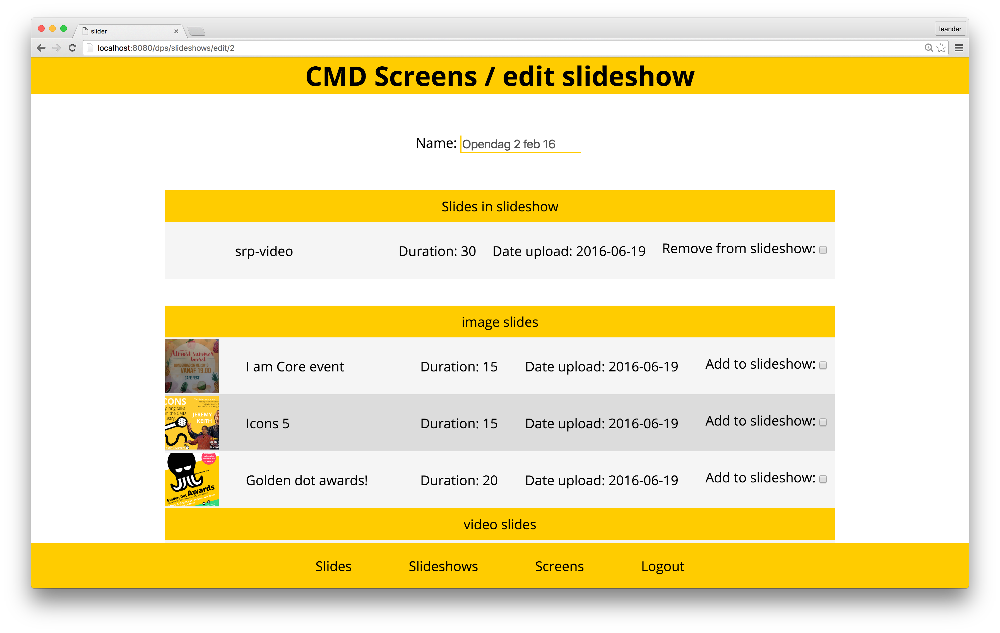
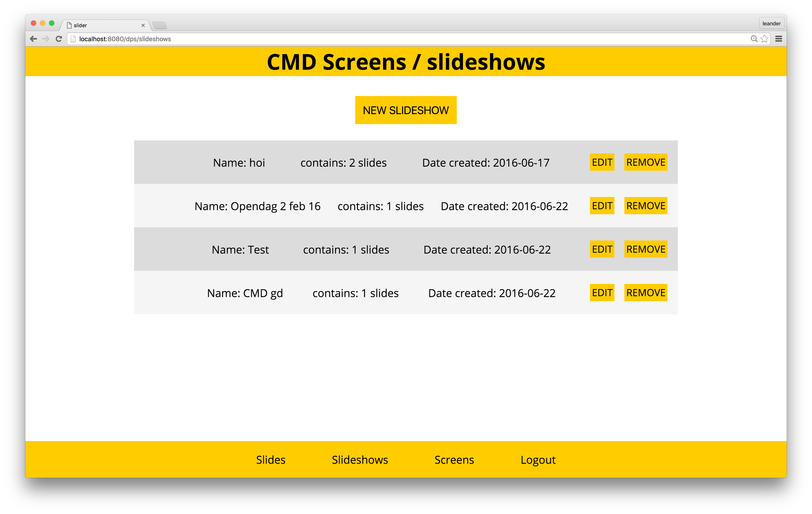
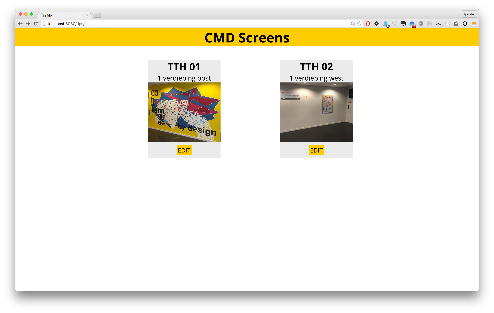
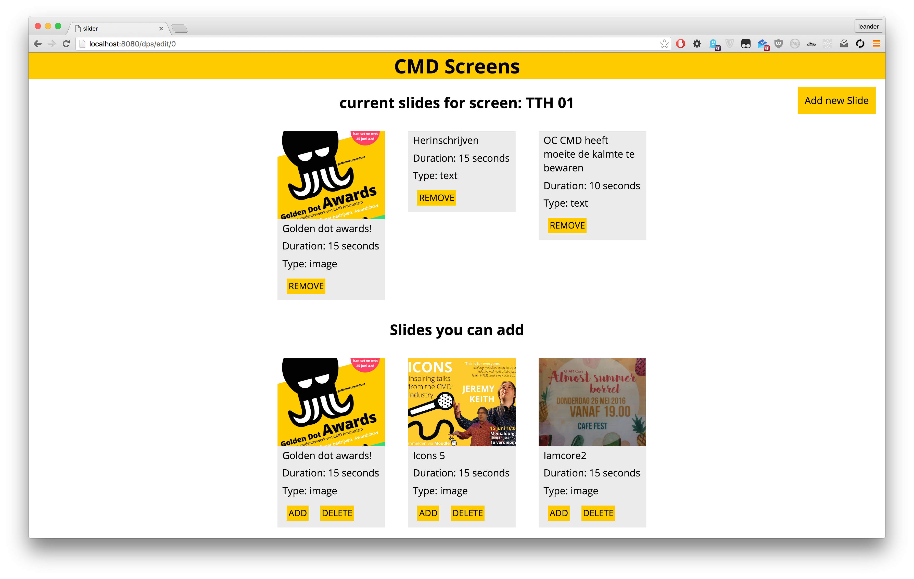

# DIGITALPOSTERS


## Herkansing

###Links

[screens.leandervanbaekel.nl](http://screens.leandervanbaekel.nl)

Hier kun je het CMS van de schermen bekijken.

Login: joost
wachtwoord: 123
-of-
Login: koop
wachtwoord: 123


[screen 1 url](http://screens.leandervanbaekel.nl/dpf/0)  
[screen 2 url](http://screens.leandervanbaekel.nl/dpf/1)

Hier kun je de schermen bekijken


[Poster](readme-img/eindposter.pdf)
Hier is de poster die ik voor de presentatie heb gemaakt.


## Issues

### [Readme aanpassen](https://github.com/LeanderVanBaekel/digitalPosters/issues/16)

Dat ben je nu aan het lezen ;)


### [UI verbeteren](https://github.com/LeanderVanBaekel/digitalPosters/issues/15)

#### Oude interface




#### Nieuwe interface
Het nieuwe interface maakt gebruikt van 'blokken' in plaats van de tabellen/lijsten. Dit is voor de gebruiker beter leesbaar. Zo zie je ook sneller de items los van elkaar inplaats van één brei aan content.

Het eerste scherm waar je op komt (na het inloggen) is een overzicht van de schermen die je kunt aanpassen.

de content op het scherm is makkelijk aan te passen met de knoppen add en remove. Je kunt gemakkelijk een slide toevoegen met de knop rechtsboven of een voorbeeld zien van de slideshow.


### [HTML verbeteren](https://github.com/LeanderVanBaekel/digitalPosters/issues/14)

In het formulier waar je slides kunt toevoegen zaten ```<br>``` elementen om het op te maken. Die zijn er nu uit gehaald zoals je [hier kunt zien](https://github.com/LeanderVanBaekel/digitalPosters/blob/master/dps/views/add-slide.ejs#L32).

In de navigatie zat een button in een ```<a>``` element. Met de nieuwe layout heb ik de hele navigatie eruit gehaald waardoor dit probleem ook weg is.

### [Client side JS aanpassen](https://github.com/LeanderVanBaekel/digitalPosters/issues/13)

#### Consistente structuur

[De nieuwe javascript client code](https://github.com/LeanderVanBaekel/digitalPosters/blob/master/dps/public/scripts/dpf-new.js) is helemaal in objecten geschreven inplaats van voor de helft. Hierdoor is de code leesbaarder geworden.

#### Dry'er

in [deze functie](https://github.com/LeanderVanBaekel/digitalPosters/blob/master/dps/public/scripts/dpf-new.js#L38) werd een hoop code herhaald.

```javascript
image: function (slide) {
    var container = document.createElement("div");
    container.setAttribute('class', 'slide dis-none');
    var innerContainer = document.createElement("div");
    innerContainer.setAttribute('class', 'content-image');

    var newImage = document.createElement("img");
    newImage.setAttribute('src', slide.content);

    innerContainer.appendChild(newImage);
    container.appendChild(innerContainer);
    var slide = slide;
    slide.html = container;
    htmlData.push(slide);
  },
  video: function (slide) {
    var container = document.createElement("div");
    container.setAttribute('class', 'slide dis-none');
    var innerContainer = document.createElement("div");
    innerContainer.setAttribute('class', 'content-video');

    var newVideo = document.createElement("video");
    // newVideo.setAttribute('autoplay', 'true');
    newVideo.setAttribute('src', slide.content);

    innerContainer.appendChild(newVideo);
    container.appendChild(innerContainer);
    var slide = slide;
    slide.html = container;
    htmlData.push(slide);
  },
  text: function (slide) {
    var container = document.createElement("div");
    container.setAttribute('class', 'slide dis-none');
    var innerContainer = document.createElement("div");
    innerContainer.setAttribute('class', 'content-text');

    var newText = document.createElement("div");
    newText.innerHTML= slide.content;

    innerContainer.appendChild(newText);
    container.appendChild(innerContainer);
    var slide = slide;
    slide.html = container;
    htmlData.push(slide);
  }
```

Ik heb deze nu zo geschreven dat alle code die hetzelfde is voor alle 3 de soorten slides niet 3 keer wordt herhaald in de functie. Hij zou technisch gezien nog kleiner kunnen met bijvoorbeeld een constructor functie. Maar omdat deze code alleen op dedicated machines draait en dit nu nog een prototype is waar nog dingen in de data kunnen veranderen leek mij dit geen goed idee.

```javascript
var container = document.createElement("div");
container.setAttribute('class', 'slide dis-none');
var innerContainer = document.createElement("div");

if (slide.contentType == "image") {
  innerContainer.setAttribute('class', 'content-image');
  var newImage = document.createElement("img");
  newImage.setAttribute('src', slide.content);
  innerContainer.appendChild(newImage);
} else if (slide.contentType == "video") {
  innerContainer.setAttribute('class', 'content-video');
  var newVideo = document.createElement("video");
  innerContainer.appendChild(newVideo);
} else {
  innerContainer.setAttribute('class', 'content-text');
  var newText = document.createElement("div");
  newText.innerHTML= slide.content;
  innerContainer.appendChild(newText);
}

```

#### IIFE
Omdat de code op een dedicated computer draait vond ik dat het niet zo heel veel verschil maakte. maar omdat het wel best-practice is heb ik de code in een [IIFE](https://en.wikipedia.org/wiki/Immediately-invoked_function_expression) gezet zodat de code niet buiten de bedoelde scope beschikbaar is.

voorbeeld:

```javascript
(function () {
  'use strict';

  //code

})();

```

## Inleiding

Voor de meesterproef van de minor Everything Web heb ik de opdracht Digital Posters gekozen. Dit ga ik doen in opdracht voor Mattijs Blekemolen.

## Het probleem

De posterframes die in de gangen bij CMD hangen worden graag gebruikt. Te graag. Daarom moet er een oplossing komen waardoor er beter en makkelijker op deze vraag ingespeeld kan worden.

## Mijn oplossing

Digitale posterframes met een slideshow van digitale content. Daarbij een CMS waarin de content beheerd kan worden.

Het prototype is hier te vinden:

[screens.leandervanbaekel.nl](http://screens.leandervanbaekel.nl)

## User stories

1.	Toon een aantrekkelijke carousel met (digitale) informatie posters in de 2 schermen op de gang.

2.	Maak een web based systeem waarmee eenvoudig posters kunnen worden geupload, in een bepaalde volgorde kunnen worden gezet en voor een bepaalde tijd kunnen worden getoond.

# De Applicatie

De applicatie is geschreven in Node.js met een [Express server](https://www.npmjs.com/package/express). Deze regelt de server en de routing. Als template engine heb ik gekozen voor [EJS](https://www.npmjs.com/package/ejs). Dit is een robuste combinatie die veel gebruikt wordt en waar veel/goede ondersteuning voor is. Voor het database heb ik gekozen voor [MongoDB](https://mongodb.com). Ik heb hiervoor gekozen omdat Mongo flexibeler is dan de grote tegenhanger MySQL, dit komt goed van pas tijdens dit project omdat nog niet alle features vanaf het begin goed op papier staan.

## Opstarten

Om de applicatie lokaal te starten moet je eerst zorgen dat er een MongoDB server draait. Daarna ga je naar de applicatie map en voer je het commando
```
sudo npm install
```
en
```
node server.js
```
uit.

## Het CMS

Voor het beheren van de schermen, slideshows en slides is een Content Management System nodig. Deze is te bereiken op [/dps](http://screens.leandervanbaekel.nl/dps) (hiervoor moet je inloggen naam: mathijs, wachtwoord: 123).

Hier zijn de volgende functies te vinden:

- Slides beheren
- slide toevoegen
- Schermen beheren
- scherm toevoegen

## De schermen

<<<<<<< HEAD
De schermen zijn te bereiken op /dpf/[scherm nummer uit cms]. Bijvoorbeeld: [/dpf/0](http://screens.leandervanbaekel.nl/dpf/0). Hier worden automatisch de slides getoont van de slideshow die gekopelt is aan het scherm nummer. Deze data wordt opgehaald via de link [/dpf/api/0](http://screens.leandervanbaekel.nl/dpf/api/0s) waarbij de '1' weer het scherm nummer is.
=======
De schermen zijn te bereiken op /dpf/[scherm nummer uit cms]. Bijvoorbeeld: [/dpf/0](http://screens.leandervanbaekel.nl/dpf/0). Hier worden automatisch de slides getoont van de slideshow die gekopelt is aan het scherm nummer. Deze data wordt opgehaald via de link [/dpf/api/0](http://screens.leandervanbaekel.nl/dpf/api/0) waarbij de '1' weer het scherm nummer is.
>>>>>>> origin/master
